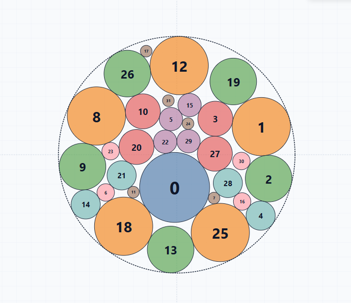

# 最小包络圆可视化智能求解器 (CableOptimizer)

[English](README.md) | [简体中文](README_zh.md)

[](https://remix-studio-8856-789804289393.us-west1.run.app)
[](https://github.com/hebaizhong-del/Minimum-Bounding-Circle-Visual-Solver/releases)
[](https://github.com/hebaizhong-del/Minimum-Bounding-Circle-Visual-Solver/releases/latest)
[](https://vitejs.dev/)
[](https://tauri.app/)
[](https://www.rust-lang.org/)
[](https://developer.mozilla.org/)
[](LICENSE)

> ### 🌟 官方部署与下载渠道
> 
> - 🌐 **在线 Web 应用（浏览器即开即用，免安装）**：  
>   👉 **[https://remix-studio-8856-789804289393.us-west1.run.app](https://remix-studio-8856-789804289393.us-west1.run.app)**  
>   *支持任何现代浏览器（电脑端与手机端），无需配置任何本地环境，直接在网页中运行。*
> 
> - 🖥️ **独立桌面客户端（Windows 单文件 .exe）**：  
>   👉 **[下载 CableOptimizer v1.0.0 Windows 客户端 (.exe)](https://github.com/hebaizhong-del/Minimum-Bounding-Circle-Visual-Solver/releases/tag/v1.0.0)**  
>   *基于 Tauri v2 构建的绿色便携版单文件程序（~15 MB），原生离线运行，零依赖、秒开。*  
>   🔗 所有发布版本与更新日志：**[GitHub Releases 页面](https://github.com/hebaizhong-del/Minimum-Bounding-Circle-Visual-Solver/releases)**

---

**CableOptimizer** 是一款交互式、高性能的**最小包络圆（Minimum Bounding / Enclosing Circle）排布求解与可视化系统**。专注于线缆线芯排布优化、圆柱形容器装载、横截面几何分析以及非线性圆排样优化设计。



---

## 📌 项目概述

将多个等径或不等径圆装入半径最小的外接圆中，属于经典的计算几何与运筹优化 NP-hard 难题。**CableOptimizer** 结合了数值梯度优化、解析几何求解器与直观的画布交互操纵：

1. **全局多起点混合优化**：自动搜索对称排布（旋转、二面体、镜像）与自由无约束布局，求解最小包络半径 $R$。
2. **交互式物理排斥与松弛重排**：支持在画布上随意拖拽任一圆，其他圆在物理排斥力作用下动态挤开避让；松开鼠标后自动触发局部 L-BFGS 紧凑收缩收敛。
3. **工程化数据导出**：支持一键导出高保真矢量 SVG、1200×1200 高清 PNG 以及标准 CSV 坐标明细表。
4. **双形态交付体系**：既可在现代浏览器中全速运行，也可打包为体积小于 $15\,\text{MB}$ 的超轻量 Windows 原生单文件桌面程序（基于 **Tauri v2**）。

---

## 🚀 核心特性

- **灵活的输入模式**：支持按逗号分隔输入各圆的**半径 ($R$)** 或 **直径 ($D$)**。
- **丰富的典型工程预设**：
  - `3 Large + 5 Small`（3大5小：`10, 10, 10, 4, 4, 4, 4, 4`）
  - `7 Equal Circles`（7等径圆：`10, 10, 10, 10, 10, 10, 10`）
  - `8 Decreasing`（8个递减圆：`12, 10, 8, 6, 5, 4, 3, 2`）
  - `12 Unequal`（12个不等径圆：`12, 10, 8, 6, 5, 4, 3, 2, 10, 8, 6, 2`）
  - `32 Unequal`（32个复杂多层不等径混合排布）
- **高精度数学优化引擎**：
  - **L-BFGS（有限内存拟牛顿法）**：平滑约束松弛与非线性目标能量收敛。
  - **阿波罗尼奥斯切圆问题（Problem of Apollonius）**：针对 3 圆切点接触进行精确解析代数求解。
  - **对称性自动发现**：自动比对**旋转对称 ($C_k$)**、**二面体对称 ($D_k$)**、**轴对称镜像**与**自由排样**的最优性。
- **现代化交互画布**：
  - 缩放（鼠标滚轮 / 右上角控制按钮）与平移（按住背景拖动画布）。
  - 各圆直接拖拽移动，具备连续物理弹性排斥响应。
  - 动态自适应外接圆实时刷新，配备背景网格与中心轴标尺。
- **直观的数据度量与监控**：
  - 外接圆最小半径 $R$。
  - 结构圆总数与最优对称性模式。
  - 完整坐标明细表（序号、半径、圆心坐标 $X$、$Y$、聚类分组）。

---

## 📐 数学建模与算法原理

### 1. 目标函数与约束
给定 $N$ 个圆，其半径分别为 $r_1, r_2, \dots, r_N$，圆心坐标为 $(x_i, y_i)$，求解外接圆圆心 $(X, Y)$ 及半径 $R$，使其半径最小化：

$$\min R$$

满足约束条件：
1. **包络约束**（所有圆必须包含在外接圆内部）：
   $$\sqrt{(x_i - X)^2 + (y_i - Y)^2} + r_i \le R, \quad \forall i \in \{1, \dots, N\}$$
2. **非重叠几何约束**（任意两圆不可发生空间侵入穿透）：
   $$\sqrt{(x_i - x_j)^2 + (y_i - y_j)^2} \ge r_i + r_j, \quad \forall 1 \le i < j \le N$$

### 2. 罚函数构造与 L-BFGS 梯度求解
将带约束非线性规划问题构造为带二次违约惩罚的无约束能量最小化函数：

$$E(p, R_c) = \sum_{i=1}^{N} \max(0, d_i + r_i - R_c)^2 + \sum_{1 \le i < j \le N} \max(0, (r_i + r_j) - d_{ij})^2$$

其中 $d_i = \sqrt{x_i^2 + y_i^2}$，$d_{ij} = \sqrt{(x_i - x_j)^2 + (y_i - y_j)^2}$。通过精确解析梯度 $\nabla_p E$ 指导 L-BFGS 快速逼近全局可行域最优解。

---

## 🛠 项目架构与目录结构

```text
cable-design-app/
├── index.html                   # 应用程序主入口网页
├── css/
│   └── style.css                # 现代化系统 UI 排版与响应式样式
├── js/
│   ├── aicable.src.js           # 核心求解算法与交互完整源码
│   └── aicable.js               # 生产环境混淆防反编译发布脚本
├── public/
│   ├── js/aicable.js            # 公开静态分发脚本
│   ├── favicon.ico
│   └── icon.png
├── scripts/
│   ├── generate_icons.js        # 多分辨率桌面图标生成脚本
│   └── obfuscate.js             # JavaScript 混淆与资产同步流水线脚本
├── src-tauri/                   # Tauri v2 原生桌面工程目录
│   ├── Cargo.toml               # Rust 依赖声明 (tauri, serde)
│   ├── tauri.conf.json          # 桌面窗口、打包目标与资源关联配置
│   ├── build.rs                 # 资源与清单嵌入构建脚本
│   ├── icons/                   # 桌面全套多尺寸图标 (.ico / .png / .icns)
│   └── src/
│       ├── main.rs              # Windows EXE 入口（Release 模式自动隐藏控制台黑框）
│       └── lib.rs               # Tauri Webview 运行时绑定桥梁
├── .github/
│   └── workflows/
│       └── release.yml          # GitHub Actions 云端 Windows .exe 自动化打包工作流
├── TAURI_GUIDE.md               # 详尽的 Tauri v2 桌面端架构与打包实战教程
├── package.json
└── vite.config.js
```

---

## 💻 快速开始

### 🌐 在线体验（推荐，零配置）
在现代浏览器中直接访问线上版本：  
👉 **[点击打开 Web 在线版](https://remix-studio-8856-789804289393.us-west1.run.app)** (`https://remix-studio-8856-789804289393.us-west1.run.app`)

### 本地开发环境要求
- [Node.js](https://nodejs.org/)（推荐 18+ 或更高版本）
- `npm` / `pnpm` / `yarn`
- *(如需本地编译桌面端)* [Rust](https://www.rust-lang.org/) 稳定版编译工具链

### 1. 安装依赖
克隆仓库并安装前端依赖包：
```bash
git clone https://github.com/hebaizhong-del/Minimum-Bounding-Circle-Visual-Solver.git
cd Minimum-Bounding-Circle-Visual-Solver
npm install
```

### 2. 启动本地开发服务
启动 Vite 本地开发服务器（默认端口 3000）：
```bash
npm run dev
```
启动后在浏览器打开 `http://localhost:3000` 即可使用。

### 3. 构建 Web 生产产物
执行代码混淆并打包生产静态资产（生成 `dist/`）：
```bash
npm run build
```

---

## 🖥️ 桌面客户端 (Tauri v2)

### 📥 下载官方 Windows 单文件安装包
无需配置任何编程环境，直接下载打包好的桌面程序：
- 🔗 **Releases 汇总页**：[GitHub Releases 发布页面](https://github.com/hebaizhong-del/Minimum-Bounding-Circle-Visual-Solver/releases)
- 💾 **最新版本直达**：[CableOptimizer v1.0.0 发布包](https://github.com/hebaizhong-del/Minimum-Bounding-Circle-Visual-Solver/releases/tag/v1.0.0)
- 🪟 **程序文件名**：`CableOptimizer.exe`（单文件便携绿色版，~15 MB）
- ⚡ **特点**：毫秒级秒开（<50ms），纯离线计算运行，内存仅占约 30 MB，基于 Windows WebView2 原生渲染。

### 本地桌面调试与构建
```bash
# 启动桌面端调试窗口
npm run tauri dev

# 编译桌面端发布安装包 (.exe)
npm run tauri build
```
编译产物生成路径：
```text
src-tauri/target/release/CableOptimizer.exe
```

### GitHub Actions 云端免环境自动化打包
项目内包含 `.github/workflows/release.yml` 流水线配置。当推送到 GitHub 并触发 Release Tag（如 `v1.0.0`）或手动点击执行时：
1. 启动微软托管的 `windows-latest` 云端虚拟机；
2. 自动配置 Node.js 22 和 Rust 稳定编译器；
3. 从 `app-icon.svg` 自动构建合规的多分辨率 Windows 图标家族；
4. 编译输出 `CableOptimizer.exe` 并自动发布挂载至 GitHub Releases 页面。

详细原理与教学请参阅：[TAURI_GUIDE.md](./TAURI_GUIDE.md)。

---

## 📊 数据导出支持

| 格式类型 | 输出文件名 | 特性说明 |
| :--- | :--- | :--- |
| **矢量 SVG** | `circle_packing_layout.svg` | 无限分辨率矢量格式，保留坐标图层与颜色分类，适用于 CAD 绘图及工程插图。 |
| **高清 PNG** | `circle_packing_layout.png` | 1200×1200 超清栅格图，白底纯净渲染，适合技术报告与论文插图。 |
| **CSV 坐标表** | `circle_positions.csv` | 包含 `Index`、`Radius`、`CenterX`、`CenterY` 及 `Group` 的结构化数值表，便于导入 Excel 或 MATLAB 分析。 |

---

## 📄 开源许可证

本项目基于 [Apache License 2.0](LICENSE) 协议开源。
